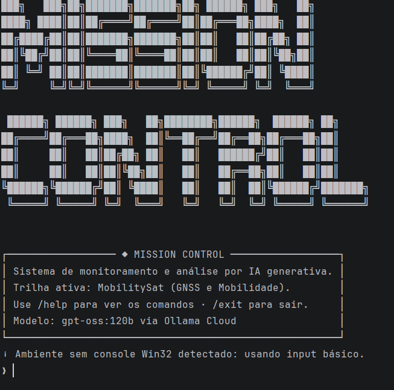
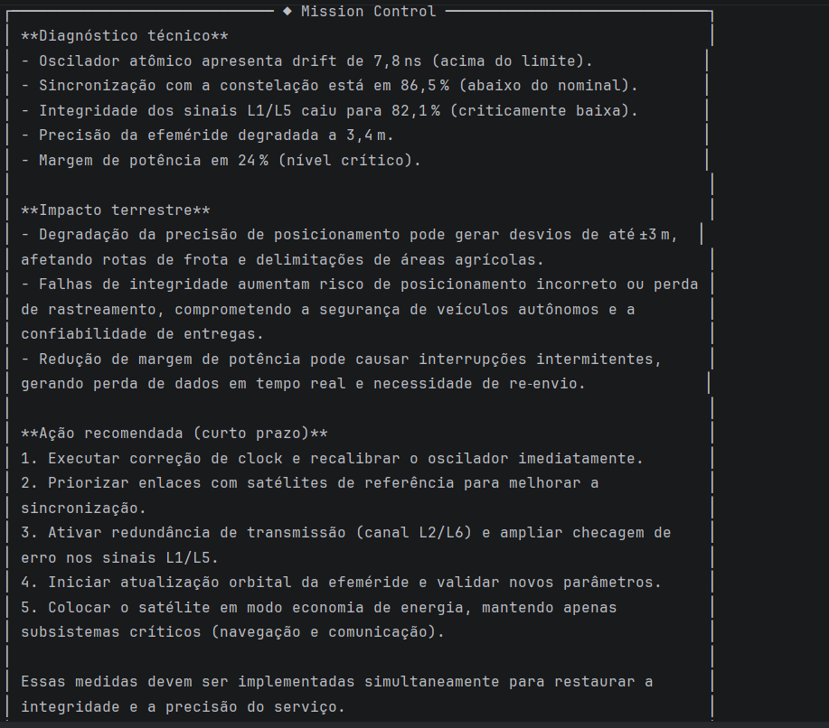

# Mission Control AI — MobilitySat

## Integrantes
- Gabriel Camarosani Gouvea Gonçalves da Silva — RM: 569189 — Turma: 1CCPG
- Gabriel Carvalho Nascimento — RM: 571381 — Turma: 1CCPG
- Guilherme Cedro Pardal Teixeira — RM: 571050 — Turma: 1CCPG

## O que o projeto faz
Este projeto simula uma missão GNSS (MobilitySat), monitora telemetria crítica e gera alertas automáticos em Python. Em seguida, envia os dados para um LLM via Ollama Cloud para produzir diagnóstico técnico com impacto terrestre em mobilidade e logística.

## Persona atendida
Engenheiro de operações de segmento espacial e gestor de frota logística que depende de posicionamento de alta disponibilidade para rotas, rastreamento em tempo real e operações de agricultura de precisão.

## Tecnologias utilizadas
- Python 3.10+
- Ollama Cloud API (`gpt-oss:120b`)
- `ollama`, `python-dotenv`, `rich`, `prompt-toolkit`, `pyfiglet`

## Como executar
1. Clone o repositório.
2. Abra a pasta do projeto.
3. Crie e ative ambiente virtual:
   - Windows PowerShell: `python -m venv .venv` e `.venv\Scripts\Activate.ps1`
4. Instale dependências: `pip install -r requirements.txt`
5. Copie `.env.example` para `.env` e preencha:
   - `OLLAMA_API_KEY=sua_chave_aqui`
6. Execute: `python main.py`

## Comandos da CLI
- `/help` — lista comandos
- `/status` — mostra snapshot + alertas atuais
- `/about` — contexto da trilha MobilitySat
- `/cenario normal` — cenário de operação nominal (útil para prints)
- `/cenario critico_sinal` — cenário com alertas críticos
- `/cenario random` — telemetria aleatória
- `/clear` — limpa terminal
- `/exit` — encerra (também aceita `sair`)

Aliases em português: `ajuda`, `status`, `sobre`, `limpar`, `cenario normal`, `cenario critico`.

## Demonstração

## System Prompt
O prompt de sistema está em [`prompts/system_prompt.md`](prompts/system_prompt.md). Ele instrui a IA a responder sempre com três blocos: **diagnóstico técnico**, **impacto terrestre** e **ação recomendada (curto prazo)**, usando os dados reais de telemetria injetados no prompt.

## Cenários de teste demonstrados
1. **Operação nominal** — `/cenario normal` + `/status` (parâmetros dentro do esperado, sem alertas críticos).
2. **Situação crítica** — `/cenario critico_sinal` + pergunta à IA (ex.: `oq fazer`) com alertas de drift, integridade e potência.
3. **Modo aleatório** — `/cenario random` para variar telemetria entre execuções.

## Limitações conhecidas
- Telemetria sintética (aleatória ou fixa por cenário), sem histórico temporal persistente.
- Alertas usam thresholds fixos em `src/alertas.py`, sem aprendizado adaptativo.
- Em ambientes sem console Win32 (ex.: Run do PyCharm), a CLI usa `input()` básico em vez do `prompt_toolkit` completo.

## Proposta de valor / modelo de negócio

1. **Qual o problema real terrestre que esta missão resolve?**  
   Frotas logísticas, transporte e agricultura de precisão dependem de GNSS confiável. Quando o satélite degrada drift, sincronização ou integridade do sinal, aumentam erros de posição, atrasos e risco operacional.

2. **Quem paga pela solução?**  
   Modelo híbrido: operadoras de segmento espacial e empresas de logística/agro (contratos B2B), com possível apoio de programas públicos de conectividade e mobilidade.

3. **Métrica de impacto:**  
   Com o satélite operando de forma estável por 1 ano, o serviço pode sustentar monitoramento contínuo para milhares de veículos, com redução estimada de desvios de rota na ordem de 1–2 m em operações críticas (ordem de grandeza, cenário simulado).

4. **Modelo de negócio:**  
   SaaS de insights operacionais — assinatura por frota ou constelação, com alertas automatizados em Python e relatórios em linguagem natural gerados por IA.

## Vídeo de demonstração
🔗 [Assistir demonstração no YouTube](https://youtu.be/8iq0elkABNA)
